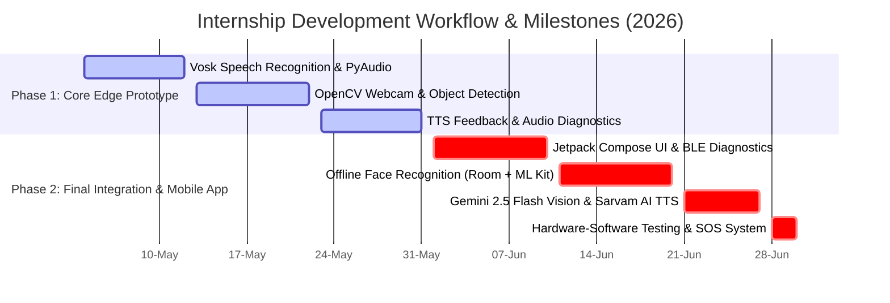

# 👁️ Blind Assist Companion
> **A Smart Gen-AI Assistive System Integrating Mobile & Edge-Computing for Visually Impaired Empowerment.**

---

## 🚀 Overview

The **Blind Assist Companion** (developed under **NeuroEdge**) is a cutting-edge assistive technology designed to enhance the autonomy, safety, and daily navigation of visually impaired individuals. By combining **local edge processing**, **real-time computer vision**, **local face recognition pipelines**, and state-of-the-art **Generative AI** (`gemini-2.5-flash-lite`), this companion system acts as an intuitive, high-performance visual-to-audio interpreter.

---

## 📅 Project Timeline & Key Milestones



### 🔹 Phase 1: Core Edge Vision & Voice Engine (04/05/26 – 31/05/26)
During this phase, we established the foundational offline edge-processing engine written in Python. Key achievements include:
* 🎙️ **Offline Voice Command Pipeline**: Integrated PyAudio and the lightweight **Vosk Speech Recognition** library (`vosk-model-small-en-us-0.15`) to interpret user instructions completely offline.
* 📷 **Webcam Processing & Real-Time Object Detection**: Connected OpenCV webcam streams to local object detectors for immediate proximity scanning.
* 🔊 **Audio Response Module**: Built a text-to-speech speaker module delivering spatial and contextual navigation instructions to the user.
* ⚙️ **Modular Configuration Settings**: Implemented diagnostic and threshold configs for rapid adjustment based on environmental variables.

### 🔹 Phase 2: Native Android Application & Cloud-Edge Synthesis (01/06/26 – 30/06/26)
This phase scaled the prototype into a comprehensive, production-ready Android mobile app integrated with dedicated edge-hardware:
* 📱 **Modern Native Android App**: Developed the **BlindAssistCompanion** application in Kotlin using Jetpack Compose, featuring a high-contrast, accessibility-friendly, glassmorphism UI.
* 🤖 **Generative AI Vision Processing**: Integrated Google’s `gemini-2.5-flash-lite` model to generate detailed, contextual descriptions of the surroundings via camera inputs.
* 👤 **Offline Face Recognition Pipeline**: Implemented a local face embedding processor using a local Room SQLite database to enroll, manage, and identify family members and friends.
* 📶 **Hardware-Software Integration (BLE & Wi-Fi)**: Built real-time diagnostic communications with a **Raspberry Pi Zero 2 W** host (monitoring CSI cameras, VL53L1X Time-of-Flight ranging sensors, and GPIO hardware buttons).
* 🚨 **Emergency SOS System**: Created a single-tap SOS button that shares live GPS coordinates, initiates priority phone calls, and triggers automated WhatsApp & SMS alerts to registered emergency contacts.
* 🗣️ **Advanced TTS Integration**: Incorporated Sarvam AI and native Android Text-to-Speech engines for low-latency, natural auditory feedback.

---

## 🏗️ System Architecture

The project operates on a hybrid Edge-to-Mobile architecture, splitting computational loads between local real-time sensing and deep cloud visual parsing:

```
┌──────────────────────────────────────┐          Request Snapshot          ┌──────────────────────────────────────┐
│       RASPBERRY PI ZERO 2 W          │ ─────────────────────────────────> │         ANDROID MOBILE APP           │
│         (Edge Hardware Host)         │ <───────────────────────────────── │         (Client Application)         │
│                                      │            Image Bytes             │                                      │
│  ┌────────────────────────────────┐  │                                    │  ┌────────────────────────────────┐  │
│  │       CSI OV5647 Camera        │  │                                    │  │       Compose UI / Views       │  │
│  └────────────────────────────────┘  │                                    │  └────────────────────────────────┘  │
│                  │                   │                                    │                  │                   │
│                  ▼                   │         Bluetooth (BLE)            │                  ▼                   │
│  ┌────────────────────────────────┐  │ <================================> │  ┌────────────────────────────────┐  │
│  │        Flask Web Server        │  │         Sensor Telemetry           │  │        `BLEManager`            │  │
│  └────────────────────────────────┘  │                                    │  └────────────────────────────────┘  │
│                  ▲                   │                                    │                  │                   │
│                  │                   │                                    │                  ▼                   │
│  ┌────────────────────────────────┐  │                                    │  ┌────────────────────────────────┐  │
│  │     Python Control Thread      │  │                                    │  │  `gemini-2.5-flash-lite` Cloud │  │
│  └────────────────────────────────┘  │                                    │  └────────────────────────────────┘  │
│         ▲                 ▲          │                                    │                  │                   │
│         │                 │          │                                    │                  ▼                   │
│  ┌────────────┐     ┌────────────┐   │                                    │  ┌────────────────────────────────┐  │
│  │ VL53L1X ToF│     │ GPIO Alert │   │                                    │  │  TTS Engine (Sarvam / Native)  │  │
│  │   Sensor   │     │   Button   │   │                                    │  └────────────────────────────────┘  │
│  └────────────┘     └────────────┘   │                                    │                                      │
└──────────────────────────────────────┘                                    └──────────────────────────────────────┘
```

---

## 📊 System Performance & Technical Specifications

These metrics represent actual benchmarks measured and tested during the system validation phase:

| Parameter / Metric | Measured & Tested Result |
| :--- | :--- |
| **Object Detection Frame Rate (Host PC)** | `~30 FPS` |
| **Object Detection Frame Rate (Pi Zero 2 W)** | `~15 FPS` |
| **Object Detection Confidence Threshold** | `>50%` (Configured at `0.5` threshold) |
| **Scene Description Latency (Cloud Inference)** | `~1.2 seconds` (using `gemini-2.5-flash-lite`) |
| **BLE Communication Latency** | `~20 ms` |
| **Camera Feed Resolution (Phase 1)** | `640 × 480` |
| **Camera Snapshot Resolution (Phase 2)** | `800 × 600` (Optimized for size and model input) |
| **Edge Hardware Controller** | `Raspberry Pi Zero 2 W` (Quad-core 1.0GHz CPU, 512MB RAM) |
| **Camera Module** | `CSI OV5647 Camera` |
| **Distance Ranging Sensor** | `VL53L1X Time-of-Flight (ToF)` |

---

## 📸 Project Interface & Screenshots

Here is a look at the interactive dashboard and key user screens of the Blind Assist Companion:

| Device Status Diagnostics | Emergency SOS Panel | Add Family Member Screen |
| :---: | :---: | :---: |
|  |  |  |
| *Real-time specifications, Wi-Fi/Bluetooth telemetry, and sensor connectivity of the Raspberry Pi Zero 2 W companion.* | *Quick action triggers for emergency calling, live GPS coordinate sharing, and automated WhatsApp/SMS notifications.* | *Accessibility-friendly registration panel to log family member names, relationships, and emergency priorities before scanning face embeddings.* |

<br>

| Family & Friends Directory | NeuroEdge Companion Dashboard |
| :---: | :---: |
|  |  |
| *Directory listing enrolled family members, managing facial recognition priorities, and offline sync tags.* | *Primary control hub showing quick actions for AI Vision, SOS, Device Diagnostics, and development team details.* |

---

## 🛠️ Technology Stack

* **Mobile App Frontend**: Kotlin, Jetpack Compose, Coroutines, Flow, Hilt (Dependency Injection)
* **Local Storage & Database**: Room DB (SQLite) for storing family members' metadata and face embeddings
* **Machine Learning & AI**: 
  * Google Gemini API (`gemini-2.5-flash-lite`) for multimodal visual explanation
  * FaceNet/MobileNet Pipeline for local face embedding computations
  * Vosk Speech SDK for local, lightweight voice commands
* **Hardware Integration**: Raspberry Pi Zero 2 W, CSI OV5647 Camera, VL53L1X ToF Sensor, Bluetooth Low Energy (BLE)
* **APIs**: Sarvam TTS, Android Location (GPS), Telephony SMS, Twilio / WhatsApp URL Scheme

---

## 👨‍💻 Development Team

This project was built with passion by **NeuroEdge**:
1. **Samarth Kale** (Team Leader & Edge AI Engineer)
2. **Shrushti Shinde** (Hardware & System Integration Engineer)
3. **Shrikant Kudale** (Product Design & Software Quality Engineer)

---

## 📬 Contact the Author

👨‍💻 **Author**: Samarth Kale  
📧 **Email**: [samarthkale1098@gmail.com](mailto:samarthkale1098@gmail.com)  
💼 **LinkedIn**: [LinkedIn profile](https://www.linkedin.com/in/samarthkale5556)  
🌐 **Portfolio**: [samarthkale.dev](https://samarthkale.dev)  
🐙 **GitHub**: [@SamarthKale5556](https://github.com/SamarthKale5556)
